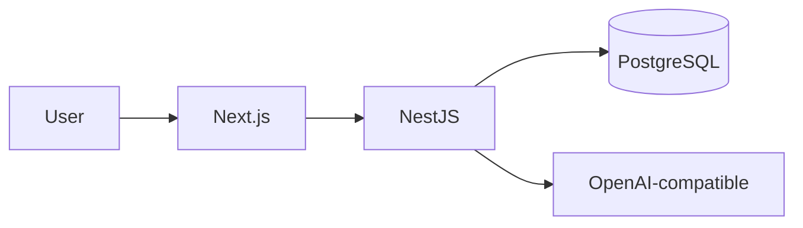

# Documentation

- Product Requirements Document (PRD): see `PRD.md` for goals, scope, architecture, AI integration, security, IaC, CI/CD, and testing.

## Writing docs

- Follow Markdown best practices.
- Lint runs in CI via markdownlint (see `.markdownlint.json`).
- Prefer fenced code blocks with a language, e.g. ```json.

## Diagrams

- You can use Mermaid in Markdown. Example:



## Contributing

See the repository `CONTRIBUTING.md` for guidelines.
